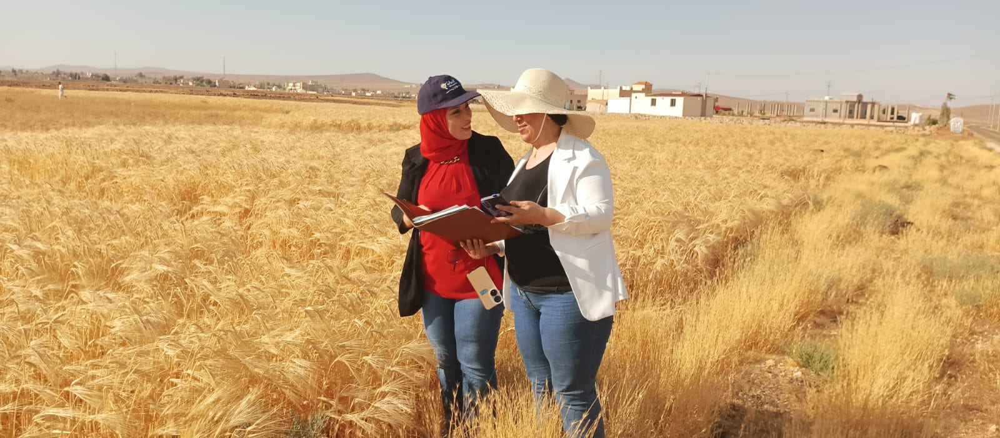

# Fieldwork and Site Documentation

## Umm Al-Jimal and Deir Al-Kahf, Jordan

This document records the preliminary fieldwork supporting **Reviving Umm Al-Jimal's Water Wisdom**, an interdisciplinary research and innovation project connecting historic rainwater-harvesting knowledge with artificial intelligence, digital simulation, climate adaptation, ecosystem recovery, education, and peacebuilding.

The fieldwork links two complementary landscapes:

- **Umm Al-Jimal:** The historic source of water wisdom and heritage-based learning.
- **Deir Al-Kahf:** The proposed pilot landscape for adapting selected principles to contemporary dryland conditions.

The field activities documented here represent an early research and assessment stage. They do not constitute a final engineering survey, construction authorization, or confirmation that the proposed pilot design has been technically approved.

---

## Fieldwork Purpose

The preliminary fieldwork was designed to:

- Observe the visible logic of historic water collection and storage at Umm Al-Jimal.
- Examine the relationship between basalt architecture, terrain, runoff, and water infrastructure.
- Translate field observations into maps, diagrams, educational materials, and digital models.
- Document the environmental character of the proposed Deir Al-Kahf pilot landscape.
- Identify preliminary opportunities and constraints affecting rainwater harvesting.
- Observe surrounding agricultural activity and patterns of land use.
- Record basalt stones, exposed soil, vegetation, slopes, and possible runoff pathways.
- Support later topographic, hydrological, soil, ecological, engineering, and safety assessments.
- Strengthen communication between heritage research, local knowledge, and modern technological innovation.

---

## 1. Umm Al-Jimal: Learning from Historic Water Wisdom

Umm Al-Jimal demonstrates how communities living in a dry basalt environment developed an integrated approach to water. Historic structures at the site provide evidence of a system based on collection surfaces, channels, sediment control, reservoirs, cisterns, gravity, overflow pathways, and careful storage.

The fieldwork did not treat these elements as isolated archaeological remains. It examined the relationships connecting them and the broader logic through which rainfall could be:

1. Collected from suitable surfaces.
2. Guided through channels.
3. Slowed to reduce erosion.
4. Separated from sediment.
5. Stored for later use.
6. Protected from excessive evaporation and contamination.
7. Distributed to people, animals, soil, or cultivated areas.
8. Directed toward additional storage or infiltration when overflow occurred.

*Field research and documentation examining the relationship between Umm Al-Jimal's basalt architecture and its historic water-management logic.*

The value of Umm Al-Jimal lies not only in preserving the past. Its water heritage can become a living educational and research resource for addressing present-day scarcity, climate uncertainty, and dryland resilience.

The project therefore seeks to interpret the principles behind the historic system rather than copy archaeological structures literally. Any modern adaptation must respond to contemporary requirements for engineering, public safety, water quality, environmental protection, accessibility, and long-term maintenance.

---

## 2. Deir Al-Kahf: Proposed Pilot Landscape

Deir Al-Kahf in Jordan's Northern Badia has been identified as the first proposed landscape for exploring how selected principles learned from Umm Al-Jimal might be adapted to contemporary dryland conditions.

The site reflects many of the challenges the project seeks to address:

- Low and variable rainfall.
- Rapid runoff during rainfall events.
- High evaporation.
- Exposed and potentially vulnerable soil.
- Basalt-rich terrain.
- Scattered vegetation.
- Pressure on agricultural and pastoral landscapes.
- The need for safe and efficient water storage.
- The decline of locally important native plants.
- The need to connect scientific research with local environmental knowledge.

*Preliminary team assessment of the proposed Deir Al-Kahf pilot landscape in Jordan's Northern Badia.*

The field visit helped establish an initial visual understanding of the landscape. The team examined terrain characteristics, basalt-stone distribution, surrounding land use, visible changes in elevation, and possible directions of surface-water movement.

These observations are preliminary and must later be verified through qualified technical studies.

---

## 3. Preliminary Site Measurement

Early field measurements were undertaken to support initial spatial thinking and photographic documentation. These activities were intended to help the team understand scale, distance, visible site relationships, and possible areas requiring detailed professional assessment.

*Early field measurement and site documentation supporting the pilot-design process.*

This preliminary measurement does not replace:

- A professional topographic survey.
- Hydrological catchment analysis.
- Rainfall-runoff modelling.
- Soil testing and infiltration assessment.
- Geotechnical investigation.
- Ecological baseline studies.
- Engineering design.
- Environmental and social safeguards.
- Legal or construction approvals.

The future technical assessment should determine the actual catchment area, slope, runoff volume, soil permeability, storage requirements, safe overflow routes, irrigation demand, and suitable locations for every proposed component.

---

## 4. Agricultural and Community Context

The proposed pilot landscape exists within a wider social and agricultural environment. Nearby cultivated fields demonstrate both the productive potential of the region and its dependence on highly variable water conditions.

*Agricultural activity near the proposed pilot landscape, illustrating the relationship between rainfall, land use, livelihoods, and dryland resilience.*

Understanding the surrounding community and agricultural context is essential. The project is not intended to create an isolated technical installation. It seeks to develop a learning and demonstration system that can connect water harvesting with:

- Local livelihoods.
- Soil and vegetation recovery.
- Climate education.
- Youth participation.
- Women's environmental knowledge.
- Agricultural awareness.
- Community cooperation.
- Responsible replication in other drylands.

Future engagement should include local residents, farmers, women, young people, researchers, technical specialists, educators, and relevant public and civil-society stakeholders.

---

## 5. Preliminary Field Observations

The following observations emerged from the initial documentation:

### Basalt Landscape

Basalt stones are a defining feature of both Umm Al-Jimal and the wider Northern Badia. They influence construction traditions, water movement, surface roughness, soil conditions, heat absorption, and the identity of the landscape.

Stones should not be removed or reorganized extensively before the site is professionally studied. Some may later support carefully designed erosion control, runoff guidance, landscape restoration, or educational interpretation, subject to technical and environmental assessment.

### Surface Runoff

The site requires detailed analysis to determine where water enters, concentrates, slows, disperses, or leaves the landscape. Visible impressions from a dry-season visit are not sufficient to establish final runoff pathways.

Future work should combine:

- Topographic surveying.
- Satellite and drone imagery where permitted.
- Digital elevation models.
- Historical rainfall information.
- On-site observation during or after rainfall.
- Hydrological modelling.
- Local community knowledge.

### Soil and Infiltration

Soil depth, texture, compaction, infiltration rate, salinity, and erosion vulnerability must be tested before selecting locations for storage, recharge, planting, or water-distribution infrastructure.

### Vegetation

The landscape includes sparse vegetation and areas affected by dryland pressure. Restoration should prioritize locally appropriate native species and avoid water-intensive or ecologically unsuitable planting.

Potential species must be selected through ecological assessment and consultation with local knowledge holders. Restoration planning may examine locally valued plants such as **Artemisia herba-alba**, **Gundelia tournefortii**, and other native dryland species where scientifically and ecologically appropriate.

---

## 6. Proposed Water-Harvesting Logic

The project is exploring a safe contemporary sequence inspired by the principles observed at Umm Al-Jimal:

**Runoff channels → protected sedimentation basin → covered main cistern or tank → drip irrigation network → recharge and infiltration garden**

### Runoff Channels

Channels or shallow landscape interventions may guide suitable runoff while reducing erosion. Their final position, dimensions, and materials must be based on verified hydrological and topographic data.

### Protected Sedimentation Basin

A small and protected basin may slow incoming water and allow sediment to settle before water enters the main storage structure. It must be designed for safe access, cleaning, overflow management, and protection of people and animals.

### Covered Main Storage

The main cistern or tank should be covered to:

- Reduce evaporation.
- Limit contamination.
- Improve safety.
- Protect people and animals.
- Support more reliable water management.
- Facilitate controlled distribution.

The project avoids large, deep, uncovered ponds.

### Drip Irrigation

Stored water may be distributed through an efficient drip-irrigation network designed around actual water availability and the needs of selected plants. Irrigation scheduling should reduce evaporation and avoid unnecessary water use.

### Recharge and Infiltration Garden

Controlled overflow or allocated water may support a carefully designed area for soil infiltration, native vegetation, ecological learning, and monitoring. This component must not be presented as groundwater recharge unless site studies demonstrate that meaningful recharge is technically possible.

---

## 7. Safety and Environmental Principles

Any future implementation must follow the principles below:

- No large, deep, or unprotected open-water structures.
- Covered primary storage wherever technically appropriate.
- Limited exposed water surfaces.
- Safe inspection and maintenance access.
- Protection of children, visitors, livestock, and wildlife.
- Controlled overflow routes.
- Sediment and erosion management.
- Water-quality safeguards appropriate to the intended use.
- Efficient irrigation and evaporation reduction.
- Ecologically suitable planting.
- Respect for archaeological heritage.
- Community consultation before implementation.
- Qualified engineering review and legal approvals.

Shade structures or solar panels may be considered where appropriate to reduce heat exposure, support energy needs, or further limit evaporation. Their feasibility must be evaluated technically and economically.

---

## 8. From Fieldwork to Digital Simulation

Field documentation will inform the development of a digital model that may integrate:

- Site photographs and field notes.
- Geographic information systems.
- Digital elevation and terrain data.
- Historic water-system interpretation.
- Rainfall and climate scenarios.
- Runoff estimates.
- Sedimentation and storage alternatives.
- Evaporation-reduction options.
- Irrigation requirements.
- Vegetation-recovery scenarios.
- Safety and maintenance considerations.

Artificial intelligence may assist with comparing scenarios, organizing evidence, identifying patterns, explaining complex systems, and producing accessible educational visualizations. AI outputs must remain subject to scientific review and field verification.

---

## 9. Community Learning and Peacebuilding

Water scarcity is not only a technical challenge. It affects health, livelihoods, education, migration, inequality, social trust, and relations between communities.

The project treats water as a potential platform for cooperation. A transparent and participatory pilot can help communities:

- Understand where water comes from and how it moves.
- Recognize the value of local and historic knowledge.
- Participate in monitoring and maintenance.
- Discuss water priorities openly.
- Reduce avoidable waste.
- Connect environmental restoration with shared benefit.
- Transform a scarce resource into a reason for collective responsibility.

This approach supports peacebuilding by demonstrating that shared environmental challenges can be addressed through evidence, fairness, participation, and cooperation.

---

## 10. Current Fieldwork Status

Completed or ongoing activities include:

- Initial documentation of Umm Al-Jimal's water heritage.
- Field observation of historic water-system relationships.
- Preliminary photographic documentation.
- Initial visits to the proposed Deir Al-Kahf pilot landscape.
- Early site measurement and spatial observation.
- Documentation of basalt terrain and surrounding agricultural activity.
- Development of an initial safe water-harvesting concept.
- Preparation of digital, educational, research, partnership, and funding pathways.

The project remains in the assessment and design stage. No conceptual diagram or preliminary field observation should be treated as a final construction specification.

---

## 11. Required Next Steps

Before physical implementation, the project should complete:

1. A professional topographic survey.
2. Catchment delineation and hydrological analysis.
3. Rainfall-runoff modelling.
4. Soil, infiltration, salinity, and erosion testing.
5. Geotechnical assessment where required.
6. Ecological baseline documentation.
7. Community and stakeholder consultation.
8. Detailed engineering design.
9. Water-storage sizing and safety review.
10. Overflow and drainage planning.
11. Irrigation and native-planting design.
12. Environmental and social safeguards.
13. Cost estimates and maintenance planning.
14. Legal, land-use, and construction approvals.
15. A monitoring, evaluation, and learning framework.

---

## 12. Documentation Ethics

Field documentation should respect:

- The dignity and privacy of participants.
- Accurate descriptions of completed and proposed activities.
- Appropriate consent for identifiable photographs.
- Proper attribution of community and local knowledge.
- Protection of sensitive archaeological and environmental information.
- Responsible use of maps and land information.
- Clear distinction between observation, interpretation, simulation, and verified scientific findings.

---

## Image Use

The photographs in this repository support research, education, project documentation, and responsible public communication.

Reuse requires:

- Appropriate attribution to the project.
- Preservation of the original context.
- No misleading presentation or false claims.
- Respect for identifiable individuals and community dignity.
- Prior permission for commercial use.

---

## Related Documents

- [Project Overview](PROJECT_OVERVIEW.md)
- [Main Repository Readme](README.md)
- [Project Images](images/README.md)

Additional technical studies, maps, field notes, diagrams, and monitoring materials will be added as the project develops.

---

## Contact

For research collaboration, technical partnership, responsible funding, or knowledge exchange:

Email: contact@digitalaljazari.org  
Website: https://digitalaljazari.org

---

*Field observation is the bridge between inherited wisdom and responsible future innovation.*
