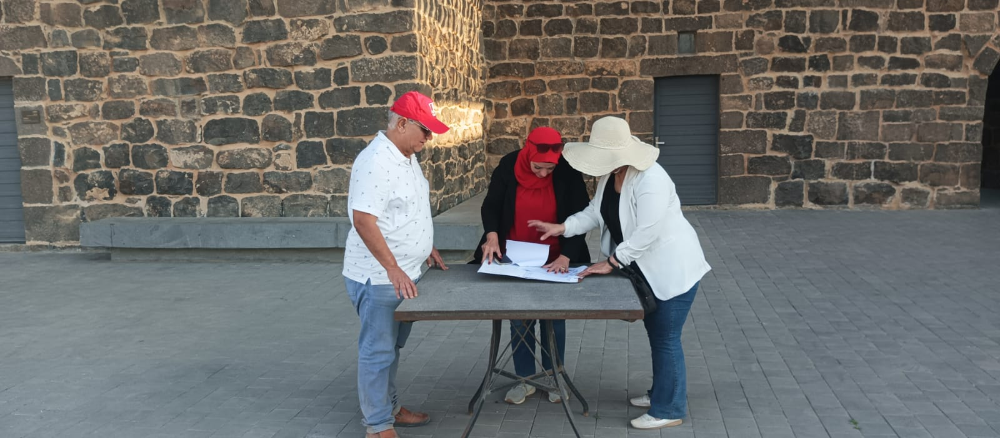
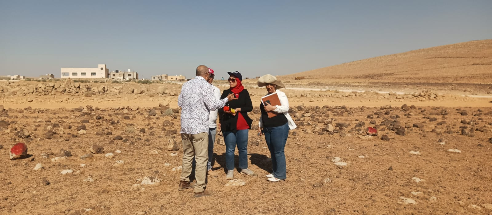

# Reviving Umm Al-Jimal's Water Wisdom

## Ancient Water Knowledge for Climate Resilience, Ecosystem Recovery, and Peacebuilding

Reviving Umm Al-Jimal's Water Wisdom is an interdisciplinary research and innovation project that studies the historic rainwater-harvesting intelligence of Umm Al-Jimal, Jordan, and adapts its underlying principles to contemporary water scarcity, climate stress, ecosystem degradation, education, and peacebuilding.

The project combines water heritage, field research, artificial intelligence, digital simulation, community participation, and safe physical replication. Its first proposed pilot pathway is being developed for Deir Al-Kahf in Jordan's Northern Badia.

---

## Explore the Project

- **[Comprehensive Project Overview](PROJECT_OVERVIEW.md)**  
  Read the project's vision, challenge, innovation, objectives, workstreams, expected outputs, and anticipated impact.

- **[Fieldwork and Site Documentation](FIELDWORK.md)**  
  Explore the preliminary field research conducted at Umm Al-Jimal and the proposed Deir Al-Kahf pilot landscape.

- **[Project Roadmap](ROADMAP.md)**  
  Follow the project from heritage research and field documentation to technical validation, pilot implementation, monitoring, and responsible replication.

- **[Contributing Guidelines](CONTRIBUTING.md)**  
  Learn how researchers, experts, communities, and institutions can contribute responsibly.

- **[Repository Use and Licensing Notice](LICENSE.md)**  
  Review the permissions, restrictions, attribution requirements, and protections applying to repository materials.

- **[Project Images](images/README.md)**  
  View information about the repository's field and visual documentation.
- **[Deir Al-Kahf Site Evidence](SITE_EVIDENCE.md)**  
  Review the public summary of land availability, agricultural suitability, documentary evidence, and confidential verification procedures.
---

---

## The Central Idea

Umm Al-Jimal demonstrates how communities living in a dry basalt environment collected, slowed, filtered, stored, and distributed scarce rainfall.

The project studies the logic connecting these historic practices and translates it into a modern, safe, and testable water-harvesting sequence:

Runoff channels → protected sedimentation basin → covered main cistern or tank → drip irrigation network → recharge and infiltration garden

The design avoids large, deep, uncovered ponds. It prioritizes:

- Covered water storage.
- Reduced evaporation.
- Sediment control.
- Safe access and maintenance.
- Protection of people and animals.
- Efficient drip irrigation.
- Native vegetation recovery.
- Controlled overflow and soil infiltration.

---

## Why This Project Matters

Arid and semi-arid communities face interconnected challenges:

- Low and highly variable rainfall.
- Rapid runoff and water loss.
- High evaporation.
- Land degradation.
- Declining native vegetation.
- Climate uncertainty.
- Pressure on farming and livelihoods.
- Social tensions intensified by water scarcity.
- Loss of historic and local environmental knowledge.

This project addresses these challenges as one connected system rather than as isolated problems.

---

## Core Project Areas

### Water Heritage

Document and interpret the historic water-management intelligence of Umm Al-Jimal as living knowledge rather than archaeological memory alone.

### Artificial Intelligence and Digital Simulation

Develop AI-assisted models for examining rainfall, runoff, storage, evaporation, irrigation, and vegetation-recovery scenarios.

### Safe Pilot Replication

Design and assess a contemporary water-harvesting pilot for Deir Al-Kahf, subject to technical studies, community consultation, safeguards, funding, and approvals.

### Ecosystem Recovery

Use harvested water efficiently to support suitable native vegetation, soil stability, biodiversity, and dryland resilience.

### Education and Community Participation

Create learning opportunities for students, researchers, families, farmers, women, young people, educators, and local institutions.

### Water and Peacebuilding

Demonstrate how shared water challenges can encourage cooperation, strengthen social trust, support livelihoods, and reduce pressure on vulnerable communities.

---

## Proposed Deir Al-Kahf Pilot

Deir Al-Kahf in Jordan's Northern Badia has been identified as the first proposed replication landscape.

Preliminary field visits and site documentation have begun. The project remains in the assessment and design stage and requires professional topographic, hydrological, soil, ecological, engineering, safety, and community studies before physical implementation.

---

## Current Status

🚧 **Under active development**

Completed and ongoing activities include:

- Initial research into Umm Al-Jimal's historic water system.
- Field observation and photographic documentation.
- Preliminary assessment of the proposed Deir Al-Kahf pilot landscape.
- Development of a safe conceptual water-harvesting sequence.
- Early digital and educational explanations.
- Preparation of research, partnership, funding, and replication pathways.

The next phase will focus on technical studies, digital modelling, community consultation, detailed design, approvals, resource mobilization, and monitored testing.

---

## Expected Outputs

- A documented map of Umm Al-Jimal's water-harvesting logic.
- AI-assisted digital models and simulations.
- A complete technical and environmental pilot design.
- A monitored water-harvesting demonstration, subject to approvals and funding.
- Educational materials and a Water Wisdom Toolkit.
- Native vegetation and soil-recovery guidance.
- Research papers, policy briefs, and field reports.
- A responsible replication framework for other arid regions.

---

## Collaboration

The project welcomes responsible cooperation with:

- Universities and research centres.
- Archaeologists, historians, and heritage specialists.
- Hydrologists, engineers, and water experts.
- AI, geospatial, and digital-simulation specialists.
- Ecologists, soil scientists, and restoration practitioners.
- Educators, schools, and youth programmes.
- Local communities, farmers, women, and civil society.
- Public institutions, technology partners, and funders.

The project is designed as an open interdisciplinary initiative and does not require exclusive affiliation with any single institution.

---

## Public Resources

- Field documentation video: [Watch on YouTube](https://youtu.be/v_kogc92Bmo)
- AI-assisted explanatory video: [Watch on YouTube](https://youtu.be/fS3pJLn690Y)
- Website: [digitalaljazari.org](https://digitalaljazari.org)

---

## Sustainable Development Goals

The project contributes particularly to:

- SDG 6: Clean Water and Sanitation
- SDG 11: Sustainable Cities and Communities
- SDG 13: Climate Action
- SDG 15: Life on Land
- SDG 16: Peace, Justice and Strong Institutions
- SDG 17: Partnerships for the Goals

---

## Responsible Use

This repository documents a developing research and innovation initiative. Conceptual diagrams and proposed pilot components are not construction specifications.

Physical implementation requires site-specific studies, qualified engineering review, legal approvals, environmental and social safeguards, safety measures, and community consultation.

Use of the repository's research, images, documentation, and future software components is governed by the [Repository Use and Licensing Notice](LICENSE.md).

---

## Contact

For research collaboration, technical partnership, responsible funding, or knowledge exchange:

Email: contact@digitalaljazari.org  
Website: https://digitalaljazari.org

---

*Ancient water wisdom can become future resilience when heritage, science, technology, and communities work together.*
