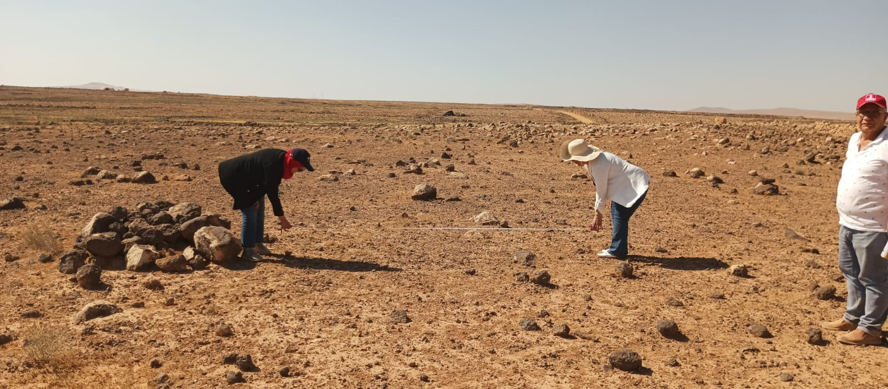

# Deir Al-Kahf Pilot Site Evidence

## Land Availability, Agricultural Suitability, and Verification

This document summarizes the evidence supporting the availability and preliminary suitability of the proposed pilot site for **Reviving Umm Al-Jimal's Water Wisdom**.

The purpose of this public summary is to demonstrate that the proposed Deir Al-Kahf pilot is connected to a real and available site while protecting personal, legal, and land-related information contained in the original documents.

Full supporting documents may be provided confidentially to qualified funders, research partners, technical reviewers, and competent authorities during formal due diligence.

---

## 1. Site Overview

The proposed pilot site is located in **Deir Al-Kahf in Jordan's Northern Badia**.

### Key Information

- **Location:** Deir Al-Kahf, Northern Badia, Jordan.
- **Approximate area:** 15 dunums.
- **Current status:** Proposed pilot and research site.
- **Landscape:** Arid basalt environment.
- **Surrounding context:** Agricultural land, dryland vegetation, exposed soil, and basalt stones.
- **Project stage:** Preliminary assessment and design.
- **Current physical implementation:** No final construction has begun.

The site was selected because it reflects many of the conditions addressed by the project, including low rainfall, climate stress, rapid runoff, high evaporation, land degradation, and declining native vegetation.

---

## 2. Land Ownership and Project Availability

The proposed 15-dunum pilot site is currently privately owned by the project lead and has been designated for the project's use.

The owner intends to formally transfer or legally dedicate the land to the project when the appropriate legal and administrative arrangements are completed.

Until a formal transfer is completed, the land may be made available to the project through a documented long-term use agreement that defines:

- The duration of project access.
- Permitted research and pilot activities.
- Responsibilities for construction and maintenance.
- Protection of project investments.
- Access for researchers, partners, and monitoring teams.
- Procedures in the event of project suspension or land transfer.
- Ownership and management of installed infrastructure.

The repository does not claim that the land is already legally registered in the project's name.

---

## 3. Documentary Evidence

The project holds supporting documentation related to the proposed pilot site.

Available evidence includes:

### Land Registration Documentation

Official land-registration documentation confirms the current ownership of the proposed pilot site.

The full document is not published publicly because it contains personal, legal, registration, and property information.

### Official Land Map

An official map identifies the land parcel and its registered boundaries.

The full-resolution map and precise registration information are retained for technical assessment and formal due diligence.

### Agricultural Suitability Correspondence

Official correspondence from the relevant agricultural authority in the Northern Badia confirms the site's suitability for agricultural use.

This confirmation supports the site's potential for carefully planned agricultural and ecological activities. It does not replace the detailed soil, water, ecological, hydrological, or engineering studies required by the proposed pilot.

### Additional Supporting Correspondence

The project maintains additional correspondence and supporting materials relevant to land availability, site assessment, and potential agricultural development.

These materials may be shared with qualified parties when required for:

- Funding assessment.
- Technical review.
- Partnership development.
- Legal due diligence.
- Governmental coordination.
- Environmental or construction approvals.

---

## 4. What the Evidence Confirms

The available evidence supports the following statements:

- The proposed site is a real and identifiable land area.
- The site covers approximately 15 dunums.
- The current owner has designated the land for project use.
- The site is available for further assessment and project planning.
- Official agricultural correspondence supports its suitability for agricultural use.
- The location can host technical, ecological, educational, and community assessments, subject to appropriate arrangements.
- The project can establish a formal legal basis for long-term use before physical investment begins.

---

## 5. What the Evidence Does Not Yet Confirm

The current documents do not independently establish:

- The final hydrological feasibility of the proposed system.
- The quantity of runoff that can be harvested.
- The final storage capacity.
- Soil infiltration or recharge performance.
- The suitability of every proposed native plant.
- Final construction permission.
- Environmental approval.
- Engineering approval.
- Water quality for any specific use.
- Long-term pilot performance.
- Legal transfer of ownership to the project.

These matters require additional professional studies, agreements, and approvals.

---

## 6. Required Technical Verification

Before physical implementation, the project should complete:

1. A professional topographic survey.
2. Catchment delineation.
3. Rainfall and runoff analysis.
4. Hydrological modelling.
5. Soil-depth and soil-texture assessment.
6. Infiltration and permeability testing.
7. Salinity and erosion assessment.
8. Ecological baseline documentation.
9. Native vegetation assessment.
10. Engineering and safety design.
11. Environmental and social safeguards.
12. Community and stakeholder consultation.
13. Legal and regulatory review.
14. Detailed cost and maintenance planning.
15. Required governmental and construction approvals.

Land availability is an essential foundation for the pilot, but it does not replace these technical requirements.

---

## 7. Preliminary Field Documentation

The site has been visited and photographed as part of the project's initial assessment.

*Preliminary assessment of the proposed Deir Al-Kahf pilot landscape.*

The field team documented:

- General landscape conditions.
- Basalt-stone distribution.
- Exposed soil.
- Surrounding agricultural activity.
- Sparse vegetation.
- Visible differences in elevation.
- Possible surface-water directions requiring professional verification.
- Areas requiring more detailed measurement and analysis.

*Early field measurement supporting spatial observation and future technical assessment.*

These activities represent preliminary field documentation and are not a substitute for a professional survey.

For further information, see [Fieldwork and Site Documentation](FIELDWORK.md).

---

## 8. Proposed Legal Pathway

Before major physical investment, the project should establish a documented legal arrangement for use of the land.

Possible arrangements may include:

- Formal transfer of ownership to an appropriate project legal entity.
- Legally documented dedication of the site to project use.
- A long-term land-use agreement.
- A registered lease or usufruct arrangement where legally appropriate.
- Another legally reviewed mechanism that protects the project and its partners.

The final mechanism should:

- Protect the long-term public and research purpose of the pilot.
- Provide sufficient security for funders and implementation partners.
- Define ownership of installed infrastructure.
- Clarify maintenance and access responsibilities.
- Prevent conflicting use during the agreed project period.
- Comply with applicable Jordanian law.

Independent legal advice should be obtained before signing or registering any arrangement.

---

## 9. Confidential Verification

Qualified funders, research institutions, implementation partners, technical reviewers, and competent authorities may request confidential verification of:

- Land-registration documentation.
- The official land map.
- Agricultural suitability correspondence.
- Ownership and land-availability evidence.
- Proposed land-use or transfer arrangements.
- Relevant supporting letters.

Documents will be shared according to legitimate due-diligence needs and subject to appropriate privacy, confidentiality, and data-protection measures.

A request for confidential documents does not automatically create a partnership, authorization, or right to use the land or project materials.

---

## 10. Public-Information Protection

The following information is intentionally not published in full in this public repository:

- Personal identification numbers.
- Personal addresses and contact details.
- Signatures.
- Document-verification codes.
- Complete registration records.
- Precise parcel and boundary information.
- High-resolution legal maps.
- Sensitive stamps or governmental references.
- Information that could enable document alteration, misuse, or unauthorized access.

Redacted versions may be published later if they provide genuine public value without creating unnecessary legal, personal, or security risks.

---

## 11. Transparency Statement

The project distinguishes clearly between:

- Land currently owned by the project lead.
- Land designated for project use.
- A planned future transfer or legal dedication.
- Preliminary agricultural suitability.
- Technical feasibility that still requires verification.
- Proposed activities.
- Approved and completed activities.

This distinction protects the project's credibility and allows potential partners to evaluate the site using accurate and verifiable information.

If the land is formally transferred or legally dedicated to the project, this document will be updated to reflect the new legal status.

---

## Related Documents

- [Project Homepage](README.md)
- [Comprehensive Project Overview](PROJECT_OVERVIEW.md)
- [Fieldwork and Site Documentation](FIELDWORK.md)
- [Project Roadmap](ROADMAP.md)
- [Contributing Guidelines](CONTRIBUTING.md)
- [Repository Use and Licensing Notice](LICENSE.md)

---

## Contact

For confidential document verification, research collaboration, technical partnership, responsible funding, or formal due diligence:

**Email:** contact@digitalaljazari.org  
**Website:** https://digitalaljazari.org

---

*Verified land availability strengthens the pathway from heritage-inspired research to responsible field implementation.*
